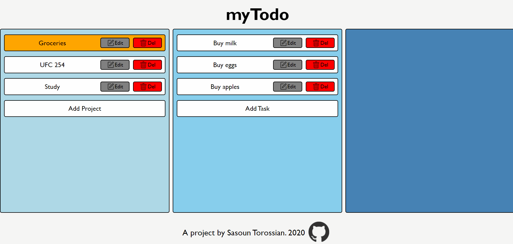

# Todo
To do app based off Odin Project curriculum. Allows users to create, edit, and delete projects, which each contain tasks. Task details on final column show title, description, priority, due date, due time, time left, and notes.  

Initial focus was on adhering to single responsibility OOP principle, which was acheived by separating logic controlling and dom controlling early on. Difficulties arose later on when dom controller began expanding, and existing code had to be moved to separate folder. Mostly managed to maintain OOP principles but could be better.

Was a fun opportunity to use emitters in order to activate event handlers in seprate files. This prevented the need for whole modules to be imported just to have access to the event handler. Also had fun experimenting with date and time manipulation using the Date object native to Javascript.

Style was simplistic as usual, but decided to implement orange highlight to complement blue background. Highlight cycling allows next project to be selected if current one is deleted, and have the highlighting automatically update.

Next time would like to predict final size of project a bit better in order to separate large code into small files earlier before they get too big and intertwined.
